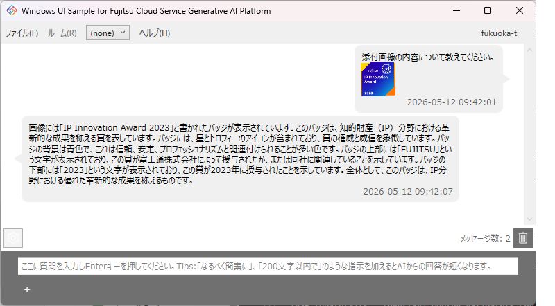

# 初めに
Fujitsu Cloud Service Genearative AI Platform の API を利用するための C# - WPF(.NET Framework) サンプルになります。  
実行ファイルはフォルダごとコピーすることでインストール作業なく Windows OS 環境で実行することができます。  
実行時の .NET Framework は、Windows 10 / 11 付属のものを利用します。

# 使い方
## 起動
1. SampleCSharpUI.exe をクリックして起動
2. 【初回起動時のみ】  
自動的にテナント名とクライアントIDを入力する [ 設定 ] 画面を表示するので、利用している Generative AI Platform 環境のテナント名とクライアント ID を入力して [OK] をクリックして保存してください。
3. 自動的にサインインが始まりますので、利用している EntraID の ID とパスワードを入力してください。
4. 「 General Use 」というルームがない場合は、自動的にRAGなしでルームを作成します。
5. 前回利用時のルームの内容を自動的に表示します。初回起動時のみ「 General Use 」ルームが選択されます。
- 「 General Use 」ルームは起動時に会話内容が全クリアされる特別なルームです。
- 他のルームは再起動しても会話内容は維持されます。

### [ 設定 ] 画面詳細
[ ファイル ]-[ 接続設定 ]メニューで接続情報を後から変更可能です。  

|  項目  |  用途  |
| ---- | ---- |
|  対話認証 | EntraID でサインインする場合に選択 |
|  TenantName | 契約時に通知されたテナント名 (gaXXXXXX) を設定 |
|  ClientId | 契約時に通知されたクライアントID |
|  (高度なオプション) | Menloなどブラウザ保護システムを採用するなど対話認証画面が表示できないときのみチェック |
|  非対話認証 | 秘密キーによる非対話が可能な契約時に選択 |
|  ClientSecret | 契約時に通知された秘密キーを設定 |

## 会話関連の操作
### 会話入力
- 画面下の [ 入力 ] 欄に質問を入力し、 Enter を押すことで送信されます。
- 改行を入力したいときは、 Shift+Enter で改行ができます。
- 送信後、 AI からの回答が返ってくるまでも入力欄に入力はできますが、 Enter による送信は、 AI からの回答がくるまで不可となっています。

### 会話の削除
[ 入力 ] 欄の上の右側には [ 会話数 ] と [ ゴミ箱 ] アイコンがあります。  
[ ゴミ箱 ] アイコンをクリックすると、最新の質問とその質問に対する AI の回答が削除されます。  
同時に、[ 入力 ] 欄に最新の質問が自動的に設定されるので、 AI から別回答を得たいときなどに便利です。

### ルーム設定の変更
[ 入力 ] 欄の上の左側には [ 歯車 ] アイコンがあります。  
[ 歯車 ] アイコンをクリックすると [ ルームの編集 ] が可能です。  
どのような項目が編集できるかの詳細は、後述の [ ルームの編集 ] を参照してください。

### 新しい会話を開始
Generative AI Platform は、プロンプトパターンとして会話履歴プロンプト (Conversation History Prompting) を採用しています。  
そのため、ルームに過去の会話が残っていると、その履歴に影響を受けた回答となります。そのため、新しい会話を始めたいときは過去の会話履歴を削除する必要があります。  
過去の会話履歴の削除は、 [ ルーム ]-[ 会話をクリア ] メニューをクリックすることで実現できます。

## ルーム関連の操作
### ルームの選択
- メニューに表示されているルーム名をクリックすると作成済ルーム一覧がリスト表示されるので、そこから移動したいルームを選択してください。

### ルームの新規作成
[ ルーム ]-[ 新規作成 ] メニューをクリックして、ルームの新規作成画面を表示します。
1. [ ルーム名 ] 欄に識別名を入力し、利用するRAGを [ リトリーバー ] 選択から選択します。なお、RAG不要時は「 none 」を選択します。
1. [OK] をクリックしルームを作成します。作成が成功したときは自動的に作成したルームに移動します。

### ルームを管理
ルーム自体を削除したり、ルームのトークン配分（回答、過去履歴、RAG参照に割り当てるトークン量の調整）を変更したいときは、 [ ルーム ]-[ 管理 ] メニューをクリックして、 [ ルーム管理 ] 画面を開きます。  

#### ルームの編集
[ ルーム管理 ] 画面で [ 編集 ] をクリックすると該当行のルームの設定内容を変更できます。  
1. [ ルーム名 ] は、空白以外の任意の名称が指定可能です。
2. [ ランダム性] は、Temperature と呼ばれるもので、0.0～1.0の範囲で0.1刻みで指定可能です。0.0を指定すると毎回同じ回答になり、1.0に近づくにつれてLLMはより様々な探索を行う可能性が高くなります。
3. 3つのトークン数は、合計が128Kに収まるように調整可能です。
4. [OK] をクリックすると変更した内容でルームを更新します。

#### ルーム削除
[ ルーム管理 ] 画面で [ 削除 ] をクリックすると該当行のルームを削除できます。  
- 削除前に確認ダイアログが表示されるので、誤操作でクリックしてしまった時は [ いいえ ] をクリックすると削除を中止できます。

## RAG関連の操作

### RAGの新規作成
[ ファイル ]-[RAG]-[ 新規作成 ] メニューをクリックして、ルームの新規作成画面を表示します。
1. [ RAG名 ] 欄に識別名を入力し、データ入力元を [Web] 、 [ ファイル ] 、 [ フォルダ ]から選択します。
    - Web：指定したURLに記載された内容からRAGを作成
    - ファイル：ダイアログで指定したファイルの内容からRAGを作成
    - フォルダ：指定したフォルダ内のファイルの内容からRAGを作成
1. [OK] をクリックしRAGを作成します。

#### RAGに含まれるデータ名について
- Webサイトを指定してRAGを作成した場合、URLの先頭にRAG作成日付をyyyyMMdd_の形式で自動付与に付与した名前で登録されます。
- ファイルを指定してRAGを作成した場合、指定したファイル名で登録されます。
- フォルダ名を指定した場合、フォルダに含まれるファイル名で登録されます。

### RAGを管理
RAG自体を削除したり、RAGに格納されているデータを変更したいときは、 [ ファイル ]-[RAG]-[ 開く ] メニューをクリックして、 [ RAG管理 ] 画面を開きます。  

#### RAG内容変更
[ RAG管理 ] 画面で [ 編集 ] をクリックすると該当行のRAGの設定内容を変更できます。  
1. [ RAG名 ] 欄を変更すると新しい識別名に変更できます。
2. データ入力元を指定することで RAG　の内容を置き換えることが出来ます。なお、全面置き換えとなりますので、更新しないデータも再度指定する必要があります。
    - Web：指定したURLに記載された内容からRAGを作成
    - ファイル：ダイアログで指定したファイルの内容からRAGを作成
    - フォルダ：指定したフォルダ内のファイルの内容からRAGを作成
3. [OK] をクリックすると変更した内容でRAGを更新します。

設定変更前の RAG を使っているルームからは自動的に新しい RAG が参照されるようになります。

#### RAG削除
[ RAG管理 ] 画面で [ 削除 ] をクリックすると該当行のRAGを削除できます。  
- 削除前に確認ダイアログが表示されるので、誤操作でクリックしてしまった時は [ いいえ ] をクリックすると削除を中止できます。

## ルームなし会話
ルームを作成することで下記のような機能をWebAPIとして提供しています。
- 過去履歴を踏まえたプロンプトパターンの実現
- ルームへ会話を記録することによる後日閲覧の実現
- 各種トークン数の設定
しかしながら、ルーム不要でTakaneに対してプロンプトを入力し回答を得るだけでよい場合には、ルームの設定や管理などの事前実行が必要なWebAPI呼び出しは煩雑に感じてしまいます。  
そのようなユースケースでは「ルームなし会話」モードがあります。

### 本サンプル画面での使い方
ルームの選択で「(none)」を選択するとチャットルームなしでの利用となります。  
サンプルコード内で画面に表示されている過去履歴を渡しているので、過去履歴を踏まえたやりとりが可能となっておりますが、過去履歴を渡さずにAPIコールをすれば、必ず入力したプロンプトだけを踏まえた回答となります。

#### 制限事項
ルームを「(none)」に選択してる場合は、ルーム編集や新規作成の機能はご利用になれません。  
ルーム編集やルーム新規作成が必要な場合は、他のルームを選択してから実行してください。

### マルチモーダル対応

ルームなし会話では、マルチモーダル対応として、添付画像に対する質問を入力することができます。  
添付できる画像ファイル形式は、png、jpeg、webp、非アニメーションgif形式の5MB以下となります。  
1. 画像の添付方法は、入力欄下の [+] ボタンをクリックしてファイル選択
2. 画像の添付解除は、画像横の [-] ボタンをクリックして解除

マルチモーダル対応は、Cohere v2 Chat 互換 API (/v2/chat)、または、Cohere OpenAI Chat Completions 互換 API (/compatibility/v1/chat/completions) を呼び出すことで実現可能です。  
サンプルコードでは、Cohere v2 Chat 互換 API を使用しています。

OpenAI 互換 API、または、Cohere V2 Chat 互換 API を呼び出すことで実現可能です。

# サンプルコードの build 方法
サンプルコードは、Visual Studio 2026 または、Visual Studio Code を使用して実行ファイルを build できます。  
Visual Studio 2026 であれば、SampleCSharpUI.sln を開いていただければ、あとは UI 上で実行や build が可能です。  
Visual Studio Code の場合は、環境設定などが必要です。

# 最後に
このサンプルが、Fujitsu Cloud Service Generative AI Platform を活用し、皆様のユーザーエクスペリエンスを飛躍的に進化させる革新的なアプリケーションを生み出すためのインスピレーションとなれば幸いです。  
さらに、本サンプルではチャットや RAG の管理においても操作性を追求した実装をアプリ側で行っていますので、皆様が開発されるアプリの管理画面設計のヒントとしてぜひご活用ください。